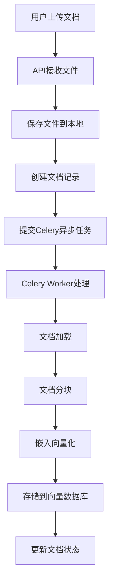
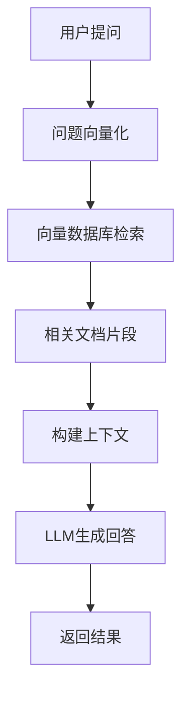
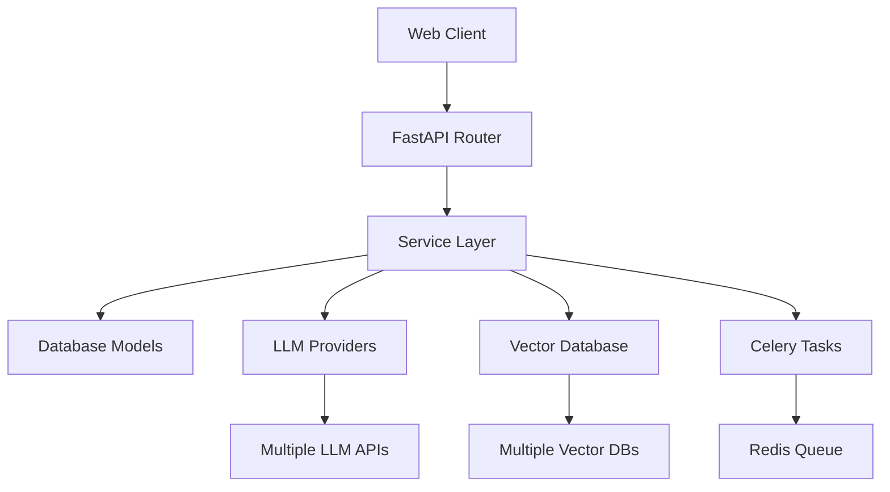

# LLM Pioneer

基于Python 3.10版本，创建FastAPI + SQLAlchemy的智能助理系统，提供大模型的问答聊天服务，并利用大模型的推理生成能力，帮助用户生成和优化产业投资分析报告。该系统采用模块化设计，支持多种大模型、嵌入模型和向量数据库，提供完整的RAG（检索增强生成）解决方案。

## 技术栈

- **Python 3.10** - 主要开发语言
- **FastAPI** - 现代高性能 Web 框架
- **SQLAlchemy** - 异步 ORM 数据库操作
- **MySQL** - 主数据库
- **Redis** - 缓存和消息队列
- **Celery** - 异步任务处理
- **Pydantic** - 数据验证和序列化
- **JWT** - 认证授权
- **LangChain** - RAG 管道和文档处理
- **Multiple Vector DBs** - 多种向量数据库支持

## 系统架构

### 核心模块

```
LLMPioneer/
├── app/                           # 核心代码目录
│   ├── api/                      # API 路由层
│   │   └── v1/endpoints/         # RESTful API 端点
│   │       ├── auth_controller/  # 认证相关
│   │       ├── manage/           # 后台管理
│   │       └── sa/               # 前端应用
│   ├── core/                     # 核心业务逻辑
│   │   ├── llm_providers/        # 大模型提供商
│   │   ├── embedding_providers/  # 嵌入模型提供商
│   │   ├── retrieval_providers/  # 向量数据库提供商
│   │   ├── langchain/           # RAG 管道
│   │   ├── celery/              # 异步任务
│   │   └── logger/              # 日志系统
│   ├── db/                      # 数据库层
│   │   ├── models/              # SQLAlchemy 模型
│   │   └── session.py           # 数据库会话
│   ├── schemas/                 # Pydantic 数据模型
│   ├── services/                # 业务逻辑服务
│   └── utils/                   # 工具类
├── config/                      # 配置文件目录
│   ├── config_llm.yaml         # 大模型配置
│   ├── config_embedding.yaml   # 嵌入模型配置
│   ├── config_retrieval.yaml   # 向量数据库配置
│   ├── config_main.yaml        # 主要配置
│   └── ...                     # 其他配置文件
├── tests/                       # 测试目录
└── logs/                        # 日志文件
```

### 多提供商支持

#### 大模型提供商 (LLM Providers)
- **OpenAI**: GPT-4, GPT-4-mini
- **Anthropic**: Claude-3.5 Sonnet, Claude-3.5 Haiku
- **Azure OpenAI**: GPT-4 models
- **Google Gemini**: Gemini-2.0-flash
- **阿里云通义千问**: Qwen-plus-latest
- **DeepSeek**: DeepSeek-coder series
- **Meta Llama**: Llama-2 series
- **HuggingFace**: 开源模型
- **Snowflake**: Cortex AI models
- **Ollama**: 本地部署模型

#### 嵌入模型提供商 (Embedding Providers)
- **OpenAI**: text-embedding-3-small
- **Azure OpenAI**: text-embedding-3-small
- **Google Gemini**: gemini-embedding
- **阿里云通义**: text-embedding-v3
- **Snowflake**: arctic-embed models
- **Elasticsearch**: multilingual-e5-small

#### 向量数据库提供商 (Vector Database Providers)
- **Qdrant**: 本地文件存储和远程服务器
- **Azure AI Search**: 企业级向量搜索
- **Elasticsearch**: 开源向量搜索
- **Milvus**: 开源向量数据库
- **PostgreSQL**: 基于 pgvector 扩展
- **OpenSearch**: 带 k-NN 插件的向量搜索
- **Snowflake**: Cortex Search Service
- **Bing Search**: 实时网络搜索

## 系统启动流程

### 1. 环境准备

```bash
# 克隆项目
git clone <repository-url>
cd LLMPioneer

# 创建虚拟环境
python -m venv .venv
.venv\Scripts\activate  # Windows
# source .venv/bin/activate  # Linux/Mac

# 安装依赖
pip install -r requirements.txt
```

### 2. 配置环境变量

创建 `.env` 文件并配置必要的环境变量：

```bash
# 数据库配置
MYSQL_HOST=localhost
MYSQL_USER=root
MYSQL_PASSWORD=your_password
MYSQL_DATABASE=sadb

# Redis 配置 (必须启动)
REDIS_HOST=localhost
REDIS_PORT=6379

# 大模型 API 密钥
OPENAI_API_KEY=your_openai_key
ANTHROPIC_API_KEY=your_anthropic_key
ALIYUN_API_KEY=your_aliyun_key
# ... 其他模型密钥

# 安全配置
SECRET_KEY=your_secret_key
```

### 3. 基础服务启动

系统依赖以下基础服务，**必须在启动应用前启动**：

#### MySQL 数据库
```bash
# 启动 MySQL 服务
sudo systemctl start mysql  # Linux
# 或使用 Docker
docker run -d --name mysql -p 3306:3306 -e MYSQL_ROOT_PASSWORD=password mysql:8.0
```

#### Redis 服务（**必需**）
```bash
# 启动 Redis 服务
sudo systemctl start redis  # Linux
# 或使用 Docker
docker run -d --name redis -p 6379:6379 redis:latest

# 验证 Redis 连接
redis-cli ping  # 应返回 PONG
```

**重要**: Redis 是系统的关键依赖，用于：
- Celery 消息队列
- 文档处理任务的异步执行
- 系统缓存

### 4. 启动应用服务

#### 方式一：开发环境（推荐）
```bash
# 启动主应用
python run.py
# 或
uvicorn app.main:app --reload --host 127.0.0.1 --port 8000
```

#### 方式二：使用 Celery Worker（用于文档处理）

**如果需要文档处理功能，必须启动 Celery Worker**：

```bash
# 新建终端，启动 Celery Worker
cd LLMPioneer
.venv\Scripts\activate
celery -A app.core.celery.celery_app worker --loglevel=info

# 或使用项目提供的启动脚本
python app/core/celery/celery_worker.py
```

#### 方式三：生产环境
```bash
gunicorn app.main:app -w 4 -k uvicorn.workers.UvicornWorker --bind 0.0.0.0:8000
```

## 文档处理和知识库构建流程

### 1. 文档上传和处理

当用户上传文档时，系统会执行以下流程：



### 2. Celery 异步任务处理

文档处理采用异步任务模式，依赖组件：

- **Redis**: 作为消息代理（broker）和结果后端（backend）
- **Celery Worker**: 执行文档处理任务
- **RAG Pipeline**: 处理文档的核心管道

### 3. 文档处理详细步骤

1. **文档加载** (`app/core/langchain/document_loader.py`)
   - 支持 PDF, DOC, DOCX, TXT 等格式
   - 提取文本内容和元数据

2. **文档分块** (`app/core/langchain/document_splitter.py`)
   - 按配置的块大小和重叠度分割
   - 保持语义完整性

3. **向量嵌入** (`app/core/langchain/embedding_provider.py`)
   - 使用配置的嵌入模型生成向量
   - 支持批量处理提高效率

4. **向量存储** (`app/core/retrieval_providers/`)
   - 存储到配置的向量数据库
   - 支持多种数据库后端

### 4. 知识库查询流程



## 配置文件详解

### 主配置 (`config/config_main.yaml`)
```yaml
project:
  name: "LLM Pioneer"
  version: "1.0.0"

mysql:
  host_env: MYSQL_HOST
  user_env: MYSQL_USER
  password_env: MYSQL_PASSWORD

redis:
  host_env: REDIS_HOST
  port: 6379
  db: 0
```

### 大模型配置 (`config/config_llm.yaml`)
```yaml
preferred_endpoint: aliyun_qwen_openai

endpoints:
  openai:
    api_key_env: OPENAI_API_KEY
    llm_type: openai
    models:
      high: gpt-4
      low: gpt-4-mini
```

### 向量数据库配置 (`config/config_retrieval.yaml`)
```yaml
write_endpoint: qdrant_local

endpoints:
  qdrant_local:
    enabled: true
    database_path: "../data/db"
    index_name: pioneer_collection
    db_type: qdrant
```

## API 文档

启动服务后访问：
- **Swagger UI**: http://localhost:8000/docs
- **ReDoc**: http://localhost:8000/redoc

### 主要 API 端点

#### 认证相关
- `POST /api/v1/auth/login` - 用户登录
- `POST /api/v1/auth/logout` - 用户登出

#### 对话管理
- `POST /api/v1/sa/conversation/` - 创建新对话
- `GET /api/v1/sa/conversation/list` - 获取对话列表
- `POST /api/v1/sa/conversation/{id}/send-message` - 发送消息
- `PUT /api/v1/sa/conversation/message/{id}` - 更新消息
- `DELETE /api/v1/sa/conversation/{id}` - 删除对话

#### 文档管理
- `POST /api/v1/sa/knowledge/document/upload` - 上传文档
- `POST /api/v1/sa/knowledge/document/process/{id}` - 处理文档
- `GET /api/v1/sa/knowledge/document/progress/{task_id}` - 查看处理进度

## 功能特性

### 1. 多轮对话系统
- 支持上下文记忆的智能对话
- 消息编辑和重新生成
- 对话历史管理

### 2. 知识库管理
- 文档上传和自动处理
- 多格式文档支持
- 异步处理和进度跟踪

### 3. RAG 检索增强
- 智能文档检索
- 上下文感知的回答生成
- 多种检索策略

### 4. 模块化设计
- 插件式提供商架构
- 配置驱动的服务选择
- 易于扩展和维护

## 故障排除

### 常见问题

1. **Redis 连接失败**
   ```bash
   # 检查 Redis 服务状态
   systemctl status redis
   # 或
   docker ps | grep redis
   ```

2. **Celery Worker 无法启动**
   ```bash
   # 检查 Redis 连接
   redis-cli ping
   # 检查环境变量
   echo $REDIS_HOST
   ```

3. **文档处理失败**
   - 检查文件格式是否支持
   - 确认 Celery Worker 正在运行
   - 查看日志文件 `logs/` 目录

4. **大模型调用失败**
   - 验证 API 密钥是否正确
   - 检查网络连接
   - 确认模型配置正确

### 日志查看

```bash
# 查看应用日志
tail -f logs/app.log

# 查看 Celery 日志
tail -f logs/celery.log
```

## 性能优化

### 1. 生产环境部署
- 使用 Gunicorn + Uvicorn 作为 WSGI 服务器
- 配置 Nginx 作为反向代理
- 使用 Redis 集群提高可靠性

### 2. 数据库优化
- 配置数据库连接池
- 添加适当的索引
- 定期清理日志表

### 3. 向量数据库优化
- 根据数据量选择合适的向量数据库
- 调整索引参数
- 使用适当的相似度算法

## 测试

```bash
# 运行单元测试
pytest

# 运行特定测试
pytest tests/unit/test_permission_system.py

# 生成测试覆盖率报告
pytest --cov=app tests/
```

## 许可证

[MIT](LICENSE)

## 开发指南

### 添加新的LLM提供商

1. 在 `app/core/llm_providers/` 创建新的提供商文件
2. 在 `config/config_llm.yaml` 添加配置
3. 在 `app/core/llm.py` 的 `_get_provider()` 函数中注册

### 添加新的向量数据库

1. 在 `app/core/retrieval_providers/` 创建客户端文件
2. 在 `config/config_retrieval.yaml` 添加配置
3. 实现 `VectorDBClientInterface` 接口

### 添加新的嵌入模型

1. 在 `app/core/embedding_providers/` 创建提供商文件
2. 在 `config/config_embedding.yaml` 添加配置
3. 继承 `BaseEmbeddings` 类

## 系统架构说明

### 多层架构设计

```
前端 (Web UI)
    ↓
API层 (FastAPI)
    ↓
业务逻辑层 (Services)
    ↓
数据访问层 (Models/Repositories)
    ↓
数据存储层 (MySQL + Vector DB)
```

### 核心组件交互



### 数据流说明

1. **用户请求流**：Web Client → API Router → Service → Database
2. **文档处理流**：Upload → Celery Task → RAG Pipeline → Vector Storage
3. **对话流**：Question → Context Retrieval → LLM → Response
4. **异步任务流**：Task Queue (Redis) → Celery Worker → Progress Update

## 内容补充

### Git 相关操作

```bash
# 初始化仓库
git init

# 关联远程仓库
git remote add origin git@gitee.com:andy0898/smart-assistant.git

# 更新仓库最新内容
git pull origin master

# 提交代码
git add .
git commit -m "Initial commit"
git push -u origin master
```

### 环境变量模板

创建 `.env` 文件并配置：

```bash
# 数据库配置
MYSQL_HOST=localhost
MYSQL_USER=root
MYSQL_PASSWORD=your_mysql_password
MYSQL_DATABASE=sadb

# Redis配置（必需）
REDIS_HOST=localhost

# 安全配置
SECRET_KEY=your-super-secret-key-here

# LLM API密钥（根据需要配置）
OPENAI_API_KEY=sk-...
ANTHROPIC_API_KEY=...
ALIYUN_API_KEY=...
GEMINI_API_KEY=...

# Azure相关（如果使用）
AZURE_OPENAI_API_KEY=...
AZURE_OPENAI_ENDPOINT=...

# 向量数据库配置（如果使用云服务）
QDRANT_URL=...
QDRANT_API_KEY=...
```

### Docker 部署

```dockerfile
# Dockerfile 示例
FROM python:3.10-slim

WORKDIR /app

COPY requirements.txt .
RUN pip install -r requirements.txt

COPY . .

EXPOSE 8000

CMD ["gunicorn", "app.main:app", "-w", "4", "-k", "uvicorn.workers.UvicornWorker", "--bind", "0.0.0.0:8000"]
```

```yaml
# docker-compose.yml 示例
version: '3.8'
services:
  app:
    build: .
    ports:
      - "8000:8000"
    environment:
      - MYSQL_HOST=mysql
      - REDIS_HOST=redis
    depends_on:
      - mysql
      - redis
  
  mysql:
    image: mysql:8.0
    environment:
      MYSQL_ROOT_PASSWORD: password
      MYSQL_DATABASE: sadb
    volumes:
      - mysql_data:/var/lib/mysql
  
  redis:
    image: redis:7-alpine
    ports:
      - "6379:6379"
  
  celery:
    build: .
    command: celery -A app.core.celery.celery_app worker --loglevel=info
    depends_on:
      - redis
    environment:
      - REDIS_HOST=redis

volumes:
  mysql_data:
```

## 贡献指南

1. Fork 项目
2. 创建特性分支 (`git checkout -b feature/AmazingFeature`)
3. 提交更改 (`git commit -m 'Add some AmazingFeature'`)
4. 推送到分支 (`git push origin feature/AmazingFeature`)
5. 打开 Pull Request

## 版本历史

- **v1.0.0** - 初始版本，基础功能实现
- 支持多种LLM提供商
- 支持多种向量数据库
- 完整的RAG pipeline
- 异步文档处理
- 多轮对话系统

---

**技术支持**: 如有问题，请在 Issues 中提出或联系开发团队。